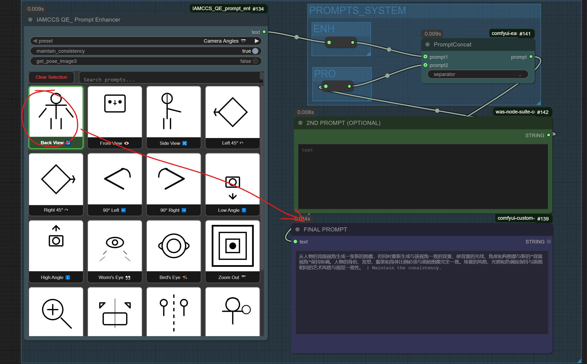

# IAMCCS QE Prompt Enhancer

**Visual prompt selector for Qwen Image Edit 2509 and other multimodal models**

Custom ComfyUI node providing a visual button grid interface for quick prompt selection, specifically designed for image editing workflows with Qwen IE 2509 and similar models.

**Author**: Carmine Cristallo Scalzi (IAMCCS)
**Website**: [www.carminecristalloscalzi.com](http://www.carminecristalloscalzi.com) | [www.faidenblass.com](http://www.faidenblass.com)
**GitHub**: [www.github.com/IAMCCS](http://www.github.com/IAMCCS)
**Patreon**: [www.patreon.com/IAMCCS](http://www.patreon.com/IAMCCS)
**Repository**: IAMCCS_QE_prompt_enhancer

## Installation

Install it from github in your ComfyUI custom_nodes directory.

Restart ComfyUI to load the node.

## Usage

1. **Add Node**: Search for "IAMCCS QE Prompt Enhancer" in ComfyUI
2. **Select Prompt**: Click any button to select a preset prompt
3. **Custom Input**: Optionally type custom prompt in the text field
4. **Connect**: Connect output to your text encoder or other text nodes
5. **Append Mode**: Toggle to combine preset + custom prompts

## Integration with Qwen Image Edit 2509

This node is specifically designed for Qwen Image Edit 2509 workflows

[Image Input] → [IAMCCS QE Prompt Enhancer] → [Text Encoder] → [Qwen Image Edit 2509]

### If my work helped you, and you’d like to say thanks — grab me a coffee ☕

### Example Workflow

1. Load your image
2. Click "Fix Face" button in QE Prompt Enhancer
3. Prompt "Enhance facial features and details" is automatically set
4. Connect to Qwen image editor for processing

## Credits

**Created by**: Carmine Cristallo Scalzi (IAMCCS)
**For**: ComfyUI
**Designed for**: Qwen Image Edit 2509 workflows
**Websites**:
- [www.carminecristalloscalzi.com](http://www.carminecristalloscalzi.com)
- [www.faidenblass.com](http://www.faidenblass.com)
- [www.github.com/IAMCCS](http://www.github.com/IAMCCS)
- [www.patreon.com/IAMCCS](http://www.patreon.com/IAMCCS)

## License

MIT

### v1.0.0 (2025-10-12)
- Initial release
- JSON configuration support
- SVG icon system

