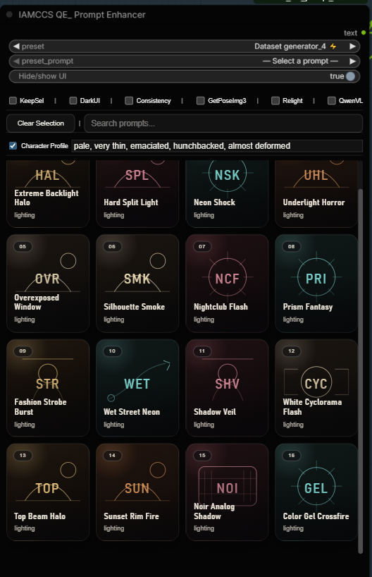
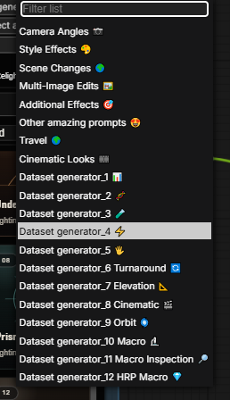
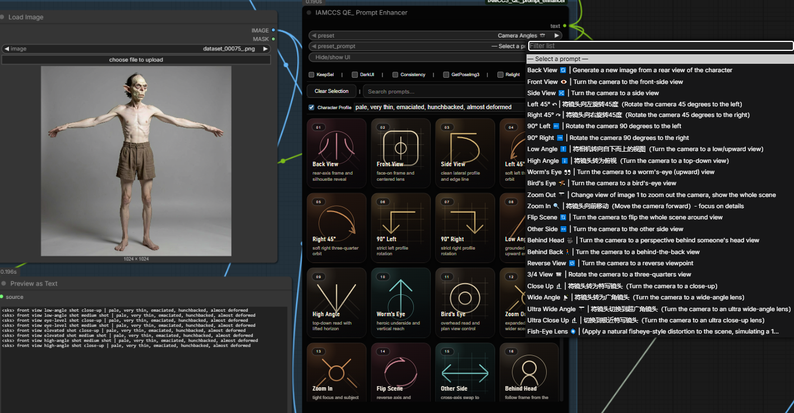

# IAMCCS QE Prompt Enhancer

**Visual prompt selector for Qwen Image Edit 2509, 2511, flux.2 Klein and other image edit models**

Custom ComfyUI node providing a visual button grid interface for quick prompt selection, specifically designed for image editing workflows with Qwen IE 2509 and similar models.

**Author**: Carmine Cristallo Scalzi (IAMCCS)
**Website**: [www.carminecristalloscalzi.com](http://www.carminecristalloscalzi.com) | [www.faidenblass.com](http://www.faidenblass.com)
**GitHub**: [www.github.com/IAMCCS](http://www.github.com/IAMCCS)
**Patreon**: [www.patreon.com/IAMCCS](http://www.patreon.com/IAMCCS)
**Repository**: IAMCCS_QE_prompt_enhancer

## Current Preset Catalog

The current prompt library contains 20 preset groups and 305 total slots.

Full slot-by-slot documentation, including every preset name, icon, and prompt text, is available in PRESET_LIST.txt.

### Preset groups

- Camera Angles (24)
- Style Effects (17)
- Scene Changes (16)
- Multi-Image Edits (16)
- Additional Effects (20)
- Other amazing prompts (16)
- Travel (16)
- Cinematic Looks (20)
- Dataset generator_1 (16)
- Dataset generator_2 (16)
- Dataset generator_3 (16)
- Dataset generator_4 (16)
- Dataset generator_5 (16)
- Dataset generator_6 Turnaround (16)
- Dataset generator_7 Elevation (16)
- Dataset generator_8 Cinematic (16)
- Dataset generator_9 Orbit (8)
- Dataset generator_10 Macro (8)
- Dataset generator_11 Macro Inspection (8)
- Dataset generator_12 HRP Macro (8)

### Macro Preset Family

The macro-oriented dataset generators are now split by role:

- Dataset generator_10 Macro: primary multi-angle macro orbit set, now adapted for Hyper Realistic Portrait workflows.
- Dataset generator_11 Macro Inspection: generic close inspection set for faces, objects, contours, and material studies.
- Dataset generator_12 HRP Macro: specialized hyper-realistic portrait macro set with pore texture, moisture, lips, eyes, wet-hair, and beauty-light prompts.

| Generator | Best use | Subject type | Look | Notes |
| --- | --- | --- | --- | --- |
| Dataset generator_10 Macro | Main multi-angle macro dataset | Face-first, still usable for general portrait work | Balanced macro orbit | Best default when you want eight usable angle variations for one subject |
| Dataset generator_11 Macro Inspection | Surface or contour study | Faces, objects, materials, edges | Technical inspection | Better for texture, rim, contour, feature-isolation, and object inspection |
| Dataset generator_12 HRP Macro | Beauty macro portrait | Faces only | Hyper-realistic portrait | Best when stacking the Hyper Realistic Portrait LoRA and pushing pores, moisture, lips, eyes, and wet-hair detail |

## New in v1.1.0

Version 1.1.0 expands the dataset creation side of the node into a much broader visual coverage system.

Highlights:

- Full dataset coverage now extends from Dataset generator_1 through Dataset generator_12.
- New families add turnaround, elevation, cinematic, orbit, macro, macro-inspection, and HRP macro coverage.
- The multiline workflow logic is now supported by dedicated companion nodes:
  - `IAMCCS_QeSplit` in this repository for splitting one QE multiline output into up to 8 direct STRING outputs.
  - `IAMCCS_QwenMultiGen` in `IAMCCS-nodes` for batch-style Qwen image-edit generation from QE multiline prompts.
- The dataset creation ecosystem also now pairs naturally with new IAMCCS-nodes companions:
  - `IAMCCS_FluxKleinMultiGen`
  - `IAMCCS_MultilinePromptSplitter8`
- Premium card styling and refreshed preset icon language give the dataset groups a clearer visual identity and make large preset libraries easier to navigate.

### Why this matters

The goal is not only to generate more images. The goal is to describe the same character more completely.

With the new preset families, one reference image can now be expanded into a much more useful visual atlas:

- structural turnarounds
- elevation changes
- cinematic framing
- orbital rotations
- macro feature studies
- beauty-oriented HRP close detail

This makes the node more useful both for dataset building and for direct image-edit pipelines where character consistency matters.

### Companion nodes for multiline workflows

This repository now includes one direct multiline companion node and pairs with one external IAMCCS-nodes generation companion:

- `IAMCCS_QeSplit`
  - Splits one QE multiline string into `prompt_1` through `prompt_8` plus `count`.
- `IAMCCS_QwenMultiGen` in `IAMCCS-nodes`
  - Runs each line of a QE multiline prompt as a separate Qwen generation pass and returns an IMAGE batch.

These nodes make it much easier to turn one dataset slot into a structured multi-view execution without manually duplicating prompt logic across the graph.

### Recommended workflow pairing

For a fuller dataset creation stack, pair the QE node with the following IAMCCS-nodes companions:

- `IAMCCS_FluxKleinMultiGen` for Flux.2 Klein multiline generation.
- `IAMCCS_MultilinePromptSplitter8` when you want more explicit multiline routing control and optional fill behavior.

Together, these nodes let one QE multiline prompt drive multi-image generation across both Qwen and Flux-based workflows.

## Previous updates

### v1.0.3

New preset for dataset creation: Dataset generator 2,3,4,5 - designed for multiline prompt workflows.
Added hide/show button.
Added Character profile to iniect prompt to multiline prompt.

### v1.0.2

The IAMCCS QE Prompt Enhancer has a new preset this release: Dataset generator 1, designed for multiline prompt workflows.

### v1.0.1

Version 1.0.1 introduces several UI improvements and new presets:

🔧 UI Update

Updated UI with new UI toggles.

Improved toolbar layout and better visual grouping of controls.

New highlight style for selected cards and dropdown sync.

🎥 New Camera Angle Presets

The Preset Camera Angle category now includes new prompt entries designed for CAMERA ANGLES PRESET

### ⚠️ Low VRAM Recommendation

If you're running on a GPU with low VRAM, it is strongly recommended to use the updated Qwen LoRA Loader from IAMCCS_nodes, recently refreshed for v1.0.1 compatibility.
You can install it:

Directly from ComfyUI Manager, or

From the GitHub repo: www.github.com/IAMCCS/IAMCCS_nodes

This ensures smoother LoRA injection and prevents VRAM overflow when using Qwen models.

## Installation

Install it from github in your ComfyUI custom_nodes directory.

Restart ComfyUI to load the node.

## Usage

Usage

Add the Node: Search for “IAMCCS QE Prompt Enhancer” in ComfyUI.
Select Prompt: Click the preview cards or use the synchronized preset_prompt dropdown.
Search: Use Search prompts… to instantly filter the grid.
Connect: Link the output to your text encoder or any text-based node.
Append Mode: Combine the selected prompt with other node settings (consistency, pose, relight, QwenVL modes).
Multiline Mode: Connect the node directly to `IAMCCS_QeSplit`, `IAMCCS_QwenMultiGen` from `IAMCCS-nodes`, or other STRING-aware workflow helpers when working with dataset generator slots.

## Integration with Qwen Image Edit 2509

This node is specifically designed for Qwen Image Edit 2509 workflows

[Image Input] → [IAMCCS QE Prompt Enhancer] → [Text Encoder] → [Qwen Image Edit 2509]

### Toolbar e controlli rapidi

Keep selection: Prevents automatic reset after each execution.
Dark previews: Black-background thumbnails with white icons for clearer visibility.
Clear Selection: Removes dropdown and card highlight.
Selected pill: Small floating pill showing the active preset.
Maintain consistency: Adds text to stabilize visual coherence.
Get pose (image 3): Injects pose-based prompt from the third input image.
QwenVL mode: Generates exclusive text-side prompts designed for qwen_vl.
A full workflow example will be included in upcoming IAMCCS releases.

### If my work helped you, and you’d like to say thanks — grab me a coffee ☕

### Example Workflow

Further instructions for the workflow example
To load the workflow as intended, you’ll also need to install the IAMCCS_annotate custom node from this repository.

## Credits

**Created by**: Carmine Cristallo Scalzi (IAMCCS)
**For**: ComfyUI
**Designed for**: Qwen Image Edit 2509, 2511, Flux.Klein workflows
**Websites**:
- [www.carminecristalloscalzi.com](http://www.carminecristalloscalzi.com)
- [www.faidenblass.com](http://www.faidenblass.com)
- [www.github.com/IAMCCS](http://www.github.com/IAMCCS)
- [www.patreon.com/IAMCCS](http://www.patreon.com/IAMCCS)

## License

MIT

### v1.0.0 (2025-10-12)
- Initial release
- JSON configuration support
- SVG icon system

